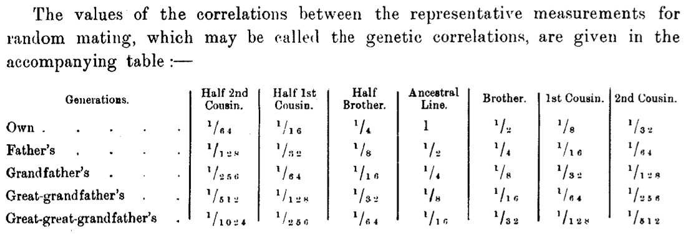

# Genetics of common complex psychiatric disorders I
Mark Adams

# Part 1: Biometrics

Mark Adams  
Division of Psychiatry  
`mark.adams@ed.ac.uk`  
*Genetics and Environmental Influences on Behaviour and Mental Health*

# What is a *“common”*, *“complex”* psychiatric disorder?

**Common:** Affects 1% or more of the population  
**Complex:** Inheritance cannot be explained by a single gene

Psychiatric disorders are defined by disruption to higher-order brain
functions of moods, perceptions, thoughts, beliefs, and behaviours but
usually in the absence of major neurological impairments (consciousness,
senses, memory). Psychiatric disorders include depressive and anxiety
disorders (major depressive disorder, panic disorder), manic and
psychotic disorders (bipolar disorder, schizophrenia),
obsessive-compulsive disorders, eating disorders (anorexia nervosa,
bulimia nervosa), substance-use disorders and personality disorders.
Childhood conditions like attention-deficit/hyperactivity and autism can
also be included, but only when they lead to clinically-salient
impairment or distress. There are also many shades of sadness,
hallucinations, eccentricities, mood swings, body-image preoccupations,
recreational substances use, personalities, etc that are not psychiatric
disorders but may still be informative to study from an aetiological and
genetic standpoint.

- Sullivan PF and Geschwind DH (2019) [Defining the Genetic, Genomic,
  Cellular, and Diagnostic Architectures of Psychiatric
  Disorders](https://doi.org/10.1016/j.cell.2019.01.015). *Cell*
  doi:10.1016/j.cell.2019.01.015

## Psychiatric diagnoses

- Depressive disorder: Marked and persistent low mood and inability to
  feel pleasure.
- Anxiety disorder: Extensive, pervasive, unrealistic, and disabling
  worry
- Bipolar disorder: Intense mood swings between mania and depression.
- Schizophrenia: Peristent hallucinations and delusions that severely
  impair functioning, highly disorganised thought and speech
- Eating disorders: self-starvation or excessive over-eating,
  debilitating preoccupation with body image
- Attention-deficit/hyperactivity disorder: Early onset, developmentally
  inappropriate and persistant hyperactivity and inattention.
- Autism spectrum disorders: Markedly impaired interpersonal
  interactions, non-goal-directed behaviours, and language development.

Sullivan, P. F., Daly, M. J. & O’Donovan, M. Genetic architectures of
psychiatric disorders: the emerging picture and its implications. Nat
Rev Genet 13, 537 551 (2012).

## 🧬👪🚬💢🏡💞🩻🏫

- Depression: 3% in a week
- Schizophrenia: 1% in lifetime
- Bipolar disorder: 2% in lifetime
- Anxiety disorder: 6% in a week

Psychiatric disorders have many causes, correlates, and consequences
(genetics, environment, family life, substance use, relationships)

Incidence of psychiatric disorders range from the common (depression,
anxiety) to the rare (bipolar disorder, schizophrenia).

# Why genetics?

Why use genetics to study mental health and psychiatric disorders?

- Biological understanding of genes, pathways
- Shared aetiology with other disorders
- Risk prediction
- Drug retargeting
- Causal analysis of environmental risk factors

## Genetics of categorical traits

Gregor Mendel (1822–1884), working in what is now Czechia, discovered
the transmission of traits from parents to offspring could be explained
by the inheritance of two “elements”, which we now call alleles. Mendel
was concerned with discrete or categorical phenotypes.

[Mendel pea plant
figure](https://commons.wikimedia.org/wiki/File:Mendel_seven_characters.svg)
by Mariana Ruiz (LadyofHats) \[public domain\]

## Genetics of continuous traits

Separately, Francis Galton (1822–1911), was studying the inheritance of
continuous or metric phenotypes. He noticed the parents who were tall
tended to have children that were slightly shorter than themselves (and
vice versa). This was termed “regression to the mean” from which the
name of the statistical method “regression” is derived.

> “In their search for universal hereditary laws, Galton and Pearson
> were driven by the linear model and the normal distribution because
> the associated parameters had scientific meaning for them that went
> beyond mere description.” - Wachsmuth, A., Wilkinson, L., & Dallal, G.
> E. (2003). [Galton’s Bend](https://dx.doi.org/10.1198/0003130031874).
> The American Statistician, 57(3), 190–192. doi:10.1198/0003130031874

For more on Galton’s legacy, see <https://adelphigenetics.org/history/>

## Reconciling categorical + continuous genetics = quantitative genetics

<!--  -->

Ronald Fisher reconciled the inheritance of continuous and categorical
phenotypes by showing that a continuous phenotype could be made from the
inheritance of a large number (dozens, hundreds, or thousands)
categorical genes. The term “variance” comes from Fisher’s discoveries.

- Fisher, R. A. (1918). [XV.—The correlation between relatives on the
  supposition of Mendelian
  inheritance](https://dx.doi.org/10.1017/S0080456800012163).
  *Transactions of the Royal Society of Edinburgh*.
  doi:10.1017/S0080456800012163
- Charlesworth and Edwards (2018). [A century of
  variance](https://doi.org/10.1111/j.1740-9713.2018.01170.x).
  *Significance* 15(4). doi:10.1111/j.1740-9713.2018.01170.x
- Bodmer et al (2021) [The outstanding scientist, R.A. Fisher: his views
  on eugenics and race](https://dx.doi.org/10.1038/s41437-020-00394-6).
  *Heredity* doi:10.1038/s41437-020-00394-6

## Polygenic traits are quantitative traits

Adding up effects from a large number of genetic effects to make a
continuous phenotype is related to the Central Limit Theorem.

> “R. A. Fisher’s 1918 paper, ‘The correlation between relatives on the
> supposition of Mendelian inheritance’, resolved the often bitter
> conflict between biometricians and Mendelians, which raged for a
> decade following the rediscovery of Mendel’s work. Fisher showed that
> a complex quantitative trait could be explained by Mendelian
> inheritance if several genes affect the trait.”Because he crossed
> true-breeding plants, Mendel’s experiments showed that a single locus
> with two alleles of equal frequency results in three genotypes (see
> the figure, part a). If the allelic effects are additive, the three
> genotypes produce three phenotypes; in the case of Mendel’s
> qualitative traits, the allelic effects showed complete dominance, so
> only two phenotypes were observed. However, assuming equal and
> additive effects, 2 genes yield 9 genotypes and 5 phenotypes (part b)
> and 3 genes yield 27 genotypes and 7 phenotypes (part c). With unequal
> and non-additive allelic effects and some environmental influence,
> three genes would result in a normal bell-shaped curve of continuous
> variation (part d). This logic assumes common alleles; rare alleles
> will skew the distribution. Genome-wide association research suggests
> that many more than three genes affect most traits, which underscores
> the expectation that polygenic traits are quantitative traits.”

- Plomin, R., Haworth, C. & Davis, O. [Common disorders are quantitative
  traits](https://dx.doi.org/10.1038/nrg2670). *Nat Rev Genet* **10**,
  872-878 (2009). doi:10.1038/nrg2670

# Biometrics

## What are the sources of family resemblance? How do we quantify them numerically?

## Heritability

Proportion of similarity in phenotypes that can be attributed to
similarity in genotypes.

**Model:** Phenotype (P) = Genotype (G) + Environment (E)  
**Variance decomposition**
$$\mathrm{var}(P) = \mathrm{var}(G) + \mathrm{var}(𝐸)$$

**Proportion of variance**
$$H^2 = \frac{\mathrm{var}(G)}{\mathrm{var}(𝑃)}, e^2 = \frac{\mathrm{var}(E)}{\mathrm{var}(𝑃)}, H^2 + e^2 = 1$$

The effect $G$ denotes all genetic effects ($G = A + D + I$ for
additive, dominance, and epistatic variance). In the more limited case
where it is assumed genetic effects act only additively (they don’t
interact with each other), then only additive genetic variance
$\mathrm{var}(A)$ is used with (narrow-sense) heritability defined as
$h^2 = \frac{\mathrm{var}(A)}{\mathrm{var}(P)}$.

- Tenesa, A., Haley, C. [The heritability of human disease: estimation,
  uses and abuses](https://dx.doi.org/10.1038/nrg3377). *Nat Rev Genet*
  **14**, 139–149 (2013). doi:10.1038/nrg3377
- Visscher, P., Hill, W. & Wray, N. [Heritability in the genomics era —
  concepts and misconceptions](https://dx.doi.org/10.1038/nrg2322). *Nat
  Rev Genet* **9**, 255–266 (2008). doi:10.1038/nrg2322

## How to estimate heritability from data

Plot of child (offspring) height versus the average of their parents’
heights. What is a statistic that can be used to summarise the
relationship between these two variables?

## How to estimate heritability from data

$\beta = \frac{\mathrm{cov}(X, Y)}{\mathrm{var}(X)}$

Estimate the beta coefficient (slope) for a simple regression from the
covariance between predictor ($X$) and outcome ($Y$) variable divided by
the variance of the predictor ($X$).

## Simple model of genetic and environmental effects

$$
P = A + E
$$

The phenotype value $P$ is influenced by an additive genetic effect $A$
and and environmental effect $E$.

For simplicity assume that $P$ is an individual’s deviation from the
average phenotype in the population.

## Simple model of genomics

$$
A = d + s
$$

Each individual has two copies of the genome, one inherited from each
parent.

Here we label the genome from the mother $d$ and the genome from the
father $s$. These are the transmitted genetic effects.

## Simple model of inheritance

Each parent also has a copy of the genome which they do not pass on to
their child, labelled $d^\prime$ for the mother and $s^\prime$ for the
father. These are the non-transmitted genetic effects.

## Simple model of genetics, environment, and inheritance

Phenotype ($P$) value is the sum of the two genetic values plus an
environmental value ($e$).

- Mother’s phenotype: $P_d = d + d^\prime + e_d$
- Father’s phenotype: $P_s = s + s^\prime + e_s$
- Child’s phenotype: $P_o = d + s + e_o$

## Regression equation

$\beta = \frac{\mathrm{cov}(X, Y)}{\mathrm{var}(X)}$

- $X$ = average of parents’ phenotypes
- $Y$ = offspring phenotype

Therefore,
$\beta = \frac{\mathrm{cov}(\frac{P_d + P_s}{2}, P_o)}{\mathrm{var}(\frac{P_d + P_s}{2})}$

## Parent–offspring covariance

$$
\mathrm{cov}(\frac{P_d + P_s}{2}, P_o)
$$

$$
= \mathrm{cov}(\frac{d + d^\prime + e_d + s + s^\prime + e_s}{2}, d + s + e_o)
$$

## Parent-offspring covariance

Expand the terms. Recall that:

$$
\mathrm{cov}(A+X,B+Y) = \\
\mathrm{cov}(A,B) + \mathrm{cov}(A,Y) + \mathrm{cov}(X,B) + \mathrm{cov}(X,Y)
$$ Thus we can do a pairwise expansion to: $$
= \mathrm{cov}(\frac{d}{2} + \frac{d^\prime}{2} + \frac{e_d}{2} + \frac{s}{2} + \frac{s^\prime}{2} + \frac{e_s}{2}, d + s + e_o)
$$ $$
= \mathrm{cov}(\frac{d}{2}, d) + \mathrm{cov}(\frac{d^\prime}{2}, d) + \dotsm+ \mathrm{cov}(\frac{e_s}{2}, e_o)
$$

## Simplifications

Some terms can be simplified.

Covariance between a genetic effect and itself $$
\mathrm{cov}(\frac{d}{2}, d), \mathrm{cov}(\frac{s}{2}, s)
$$

Simplifies to:

$$
\mathrm{cov}(\frac{d}{2}, d) = \frac{1}{2}\mathrm{cov}(d, d) = \frac{1}{2}\mathrm{var}(d)
$$ $$
\mathrm{cov}(\frac{s}{2}, s) = \frac{1}{2}\mathrm{cov}(s, s) = \frac{1}{2}\mathrm{var}(s)
$$

## Assumptions

For some terms we might make an assumption that they are equal to 0.

*Covariance between genetic effects from the same parent* $$
\mathrm{cov}(\frac{d^\prime}{2}, d), \mathrm{cov}(\frac{s^\prime}{2}, s)
$$

If there is inbreeding (individual does not have ancestors that are
closely related) or assortative mating in the grandparental generation,
then genetic effects from the same parent would be expected to have a
non-zero covariance.

*Covariance between genetic effects from different parents* $$
\mathrm{cov}(\frac{d^\prime}{2}, s), \mathrm{cov}(\frac{s^\prime}{2}, d)
$$

If there is assortative mating between the parents, then these effects
would be expected to covary

## 

Covariance between parent and offspring environment effects $$
\mathrm{cov}(\frac{e_d}{2}, e_o), \mathrm{cov}(\frac{e_s}{2}, e_o)
$$

If aspects of the parental environment are transmitted as well or if
parents and offspring tend to encounter similar environments, then these
effects are expected to covary.

Covariance between parental genetic and offspring environmental effects
$$
\mathrm{cov}(\frac{d}{2}, e_o), \mathrm{cov}(\frac{s}{2}, e_o)
$$

If parental genetic effects shape the environment of the offspring
(referred to as indirect genetic effects), then these effects are
expected to covary as well.

## 

Using those assumptions the parent–offspring covariance simplifies to

$$
\mathrm{cov}(\frac{P_d + P_s}{2}, P_o) = \frac{\mathrm{var}(d) + \mathrm{var}(s)}{2}
$$

## Parent variance

The denominator in the regression equation was $$
\mathrm{var}(\frac{P_d + P_s}{2})
$$

## 

Using the identity $$
\mathrm{var}(aX + bY) = a^2\mathrm{var}(X) + b^2\mathrm{var}(Y) + 2ab\mathrm{cov}(X, Y)
$$ the variance of the average parental phenotypes is: $$
\mathrm{var}(\frac{P_d + P_s}{2}) = \mathrm{var}(\frac{1}{2}P_d + \frac{1}{2} P_s)
$$ $$
= \left(\frac{1}{2}\right)^2\mathrm{var}(P_d) + \left(\frac{1}{2}\right)^2\mathrm{var}(P_s) + 2 \cdot \frac{1}{2} \cdot \frac{1}{2} \mathrm{cov}(P_d, P_s)
$$ $$
= \frac{1}{4}\mathrm{var}(P_d) + \frac{1}{4}\mathrm{var}(P_s) + \frac{1}{2} \mathrm{cov}(P_d, P_s)
$$

## 

If we assume as above that there is no covariation between parental
effects ($\mathrm{cov}(P_d, P_s) = 0$), this simplifies to

$$
= \frac{\mathrm{var}(P_d) + \mathrm{var}(P_s)}{4}
$$

## 

Thus the regression equation is:

$$
\beta = \frac{\mathrm{cov}(\frac{P_d + P_s}{2}, P_o)}{\mathrm{var}(\frac{P_d + P_s}{2})} \\
= \frac{\frac{\mathrm{var}(d) + \mathrm{var}(s)}{2}}{\frac{\mathrm{var}(P_d) + \mathrm{var}(P_s)}{4}} \\
= 2\frac{\mathrm{var}(d) + \mathrm{var}(s)}{\mathrm{var}(P_d) + \mathrm{var}(P_s)}
$$

## 

Previously we defined

$$
A = d + s
$$ thus $$
\mathrm{var}(A) = \mathrm{var}(d) + \mathrm{var}(s)
$$ and assume variances in parental phenotypes are equal $$
\mathrm{var}(P_d) = \mathrm{var}(P_s) = \mathrm{var}(P)
$$

## 

Then substitute into the regression equation

$$
\beta = 2\frac{\mathrm{var}(d) + \mathrm{var}(s)}{\mathrm{var}(P_d) + \mathrm{var}(P_s)} \\
= 2 \frac{\mathrm{var}(A)}{\mathrm{var}(P) + \mathrm{var}(P)} \\
= 2 \frac{\mathrm{var}(A)}{2 \mathrm{var}(P)} \\
= \frac{\mathrm{var}(A)}{\mathrm{var}(P)} \\
= h^2
$$

In other words, the beta coefficient from the regression of offspring
phenotype on average parent phenotype yields an estimate of the
heritability!

## Height data

Using the height data, we can calculate the mid-parent–offspring
covariance and mid-parent variance and then use that as an estimate for
the heritability.

- $\mathrm{cov}(\frac{P_d + P_s}{2}, P_o) =$ 12.57
- $\mathrm{var}(\frac{P_d + P_s}{2}) =$ 22.04
- $\hat{h}^2 =$ 12.57 / 22.04 = 0.57

## 

Parent and offspring phenotypes become more highly correlated as
heritability increases.

Wray, N. & Visscher, P. (2008) [Estimating trait
heritability](https://www.nature.com/scitable/topicpage/estimating-trait-heritability-46889/).
Nature Education 1(1):29

## 

**Mini review: What assumptions have we made when estimating $h^2$?**

Parents’ environments are not similar: $\mathrm{cov}(e_d, e_s) = 0$  
No assortative mating: $\mathrm{cov}(d, s) = 0$  
Parents do not transmit their environments:
$\mathrm{cov}(e_o, e_d) = 0$, $\mathrm{cov}(e_o, e_s) = 0$  
No gene-environment correlation: $\mathrm{cov}(d, e_d) = 0$,
$\mathrm{cov}(s, e_s) = 0$  
No genetic nature: $\mathrm{cov}(d, e_o) = 0$,
$\mathrm{cov}(s, e_o) = 0$  
No inbreeding: $\mathrm{cov}(d, d^\prime) = 0$,
$\mathrm{cov}(s, s^\prime) = 0$  
Genetic effects are additive: $Y = a + a^\prime + e$  
Genetic influence is the same for both sexes:
$\mathrm{var}(d + d^\prime) =  var(s + s^\prime)$

## Generalising to other relatives

Heritability can also be estimated from resemblance between different
types of related pairs. The general equation is:

$$
h^2 = \frac{b}{\mathrm{r}}
$$

$b$ = regression coefficient  
$\mathrm{r}$ = relatedness coefficient (“coefficient of additive
variance”)

In this notation we used normal $\mathrm{r}$ to represent relatedness,
to disguish it from italic $r$ for correlation coefficient.

## Example data: depression scores

Correlation of depression scores for different pairs of relatives

Fernandez-Pujals AM et al. (2015) Epidemiology and Heritability of Major
Depressive Disorder, Stratified by Age of Onset, Sex, and Illness Course
in Generation Scotland: Scottish Family Health Study (GS:SFHS). *PLOS
ONE* 10(11): e0142197.
doi:[10.1371/journal.pone.0142197](https://dx.doi.org/10.1371/journal.pone.0142197)

## Recurrance risk to relatives

$$
\lambda_\mathrm{R} = \frac{P(\mathrm{affected} | \mathrm{relative\ affected})}{P(\mathrm{affected\ in\ population})} = \frac{K_\mathrm{R}}{K}
$$

Represents how much more likely to are to be affected by a disorder
given that a relative is affected, compared to someone from the general
population.

## 

Example:

- $K_\mathrm{sib} = P(\mathrm{affected} | \mathrm{sibling\ affected}) = 0.09$
- $K = P(\mathrm{affected\ in\ population}) = 0.02$
- $\frac{K_\mathrm{sib}}{K} = \frac{0.09}{0.02} = 4.5$

## Recurrance risk for schizophrenia

Recurrance risk to relatives for schizophrenia in Sweden, which has a
baseline risk of $K = 0.47$%.

Lichtenstein, P. et al. Recurrence risks for schizophrenia in a Swedish
National Cohort. Psychol. Med. 36, 1417–1425 (2006).
doi:[10.1017/s0033291706008385](https://dx.doi.org/10.1017/s0033291706008385)

## Recurrance risk and heritability

- Score $\mathrm{unaffected} = 0, \mathrm{unaffected} = 1$
- If population prevalence is $K$, then phenotypic variance is $K(1-K)$
  (Bernoulli distribution)

## 

- $Y$ = score of individual (proband)
- $Y_\mathrm{R}$ = score of relative of proband
- Expectation: $E[Y] = E[Y_\mathrm{R}] = K$
- $K_\mathrm{R} = E[Y_\mathrm{R} | Y = 1]$
- Probability that both $Y$ and $Y_\mathrm{R}$ = 1:
  $E[YY_\mathrm{R}] = K \times K_\mathrm{R}$

$$
\mathrm{cov}(Y, Y_\mathrm{R}) = E[YY_\mathrm{R}] - E[Y] E[Y_\mathrm{R}] \\
= K \times K_\mathrm{R} - K^2 \\
$$

- James, J. W. Frequency in relatives for an all-or-none trait. Ann.
  Hum. Genet. 35, 47–49 (1971).
  doi:[10.1111/j.1469-1809.1956.tb01377.x](https://doi.org/10.1111/j.1469-1809.1956.tb01377.x)
- Risch N. Linkage strategies for genetically complex traits. I.
  Multilocus models. Am J Hum Genet. 1990 Feb;46(2):222-8. PMID: 2301392

## 

$$
\mathrm{cov}(Y, Y_\mathrm{R}) = E[YY_\mathrm{R}] - E[Y] E[Y_\mathrm{R}]
$$

$$
= K \times K_\mathrm{R} - K^2 \\
= K(K_\mathrm{R} - K) \\
= K^2 (\frac{K_\mathrm{R}}{K} - 1) \\
= K^2 (\lambda_\mathrm{R} - 1)
$$

## Heritability estimate

$$
h^2 = \frac{\mathrm{cov}_\mathrm{R}}{\mathrm{r}V_\mathrm{P}} \\
= \frac{K^2 (\lambda_\mathrm{R} - 1)}{\mathrm{r}K(1-K)} \\
= \frac{K (\lambda_\mathrm{R} - 1)}{\mathrm{r}(1-K)} \\
$$

## Recurrance risk of psychiatric disorders

![Prevalence in population (K) and with one parent affected
(K\[1\])](geibmh-psychgen-1_files/figure-commonmark/psy_rr-1.png)

Baselmans, B. M. L., Yengo, L., Rheenen, W. van & Wray, N. R. Risk in
relatives, heritability, SNP-based heritability and genetic correlations
in psychiatric disorders: a review. Biol Psychiat (2020)
doi:10.1016/j.biopsych.2020.05.034.

## Estimating environmental effects

Contrast pairs of relatives that have comparable environmental
similarity but different genetic similarity.

- Monozygotic (MZ) twins $\mathrm{r} = 1.0$
- Dizygotic (DZ) twins $\mathrm{r} = 0.5$

[Zygote development
figure](https://commons.wikimedia.org/wiki/File:Identical-fraternal-sperm-egg.svg)
CC-BY-SA Trikly.

## Additive genetic and shared environment effects

Add a shared ($C$ or “common”) environment to the basic genetic model,
to capture similarity between relatives attributable to environmental
factors. $E$ represents the unique, non-shared environment.

$$P = A + C + E$$

$$h^2 = \frac{\mathrm{var}(A)}{\mathrm{var}(P)}, c^2 = \frac{\mathrm{var}(C)}{\mathrm{var}(P)}, e^2 = \frac{\mathrm{var}(E)}{\mathrm{var}(P)}$$

$$h^2 + c^2 + e^2 = 1$$

## Twin correlations

MZ twins: $r_\mathrm{MZ} = h^2 + c^2$

DZ twins: $r_\mathrm{DZ} = \frac{1}{2}h^2 + c^2$

## 

### Solve for genetic similarity ($h^2$)

Calculate difference between MZ and DZ correlations

$$
r_\mathrm{MZ} - r_\mathrm{DZ} = (h^2 + c^2) - (\frac{1}{2}h^2 + c^2)
$$

$$
r_\mathrm{MZ} - r_\mathrm{DZ} = h^2 - \frac{1}{2}h^2 + c^2 - c^2
$$

$$
r_\mathrm{MZ} - r_\mathrm{DZ} = \frac{1}{2}h^2
$$

$$
h^2 = 2(r_\mathrm{MZ} - r_\mathrm{DZ})
$$

## 

Substitute $h^2$ into MZ equation and solve for shared environment
similarity ($c^2$)

$$
r_\mathrm{MZ} = \underbrace{h^2} + c^2
$$

$$
r_\mathrm{MZ} = 2(r_\mathrm{MZ} - r_\mathrm{DZ}) + c^2
$$

$$
r_\mathrm{MZ} - 2(r_\mathrm{MZ} - r_\mathrm{DZ}) = c^2
$$

$$
c^2 = r_\mathrm{MZ} - 2r_\mathrm{MZ} + 2r_\mathrm{DZ}
$$

$$
c^2 = 2r_\mathrm{DZ} - r_\mathrm{MZ}
$$

## 

Therefore from MZ and DZ twin correlations we can estimate:

$$
h^2 = 2(r_\mathrm{MZ} - r_\mathrm{DZ}) \\
c^2 = 2r_\mathrm{DZ} - r_\mathrm{MZ} \\
e^2 = 1 - h^2 - c^2
$$

![Visualisation with *r*\[MZ\] = 0.75 and *r*\[DZ\] =
0.5.](geibmh-psychgen-1_files/figure-commonmark/twins_cor-1.png)

## What do we know about psychiatric genetics from twins studies

Polderman TJC et al.  [Meta-Analysis of the Heritability of Human Traits
based on Fifty Years of Twin
Studies](https://dx.doi.org/10.1038/ng.3285) *Nature Genetics*
doi:10.1038/ng.3285

## Meta-analysis of twin heritability

Mental and behavioural disorders are on average moderately heritable
with a smaller but substantial portion attributable to the shared
environment.

Data from [`match.ctglab.nl`](https://match.ctglab.nl).

## 

## Genetic values
