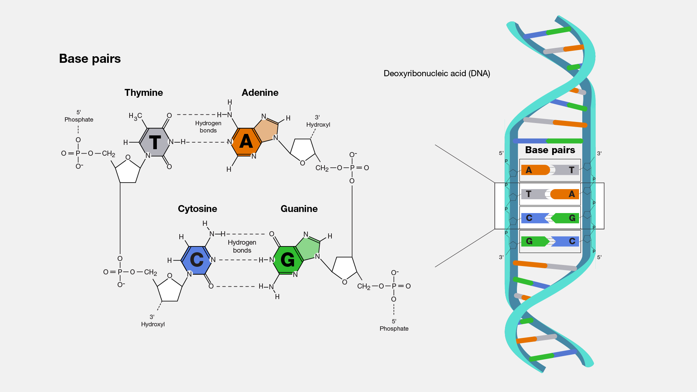
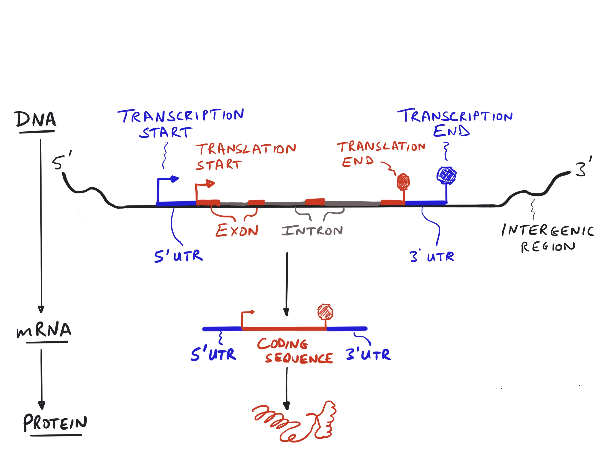
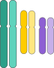
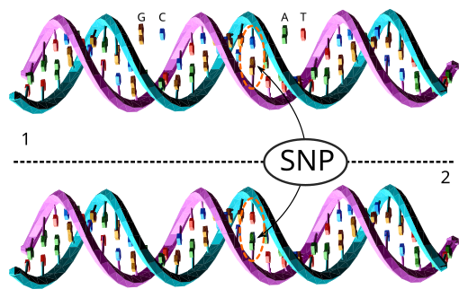
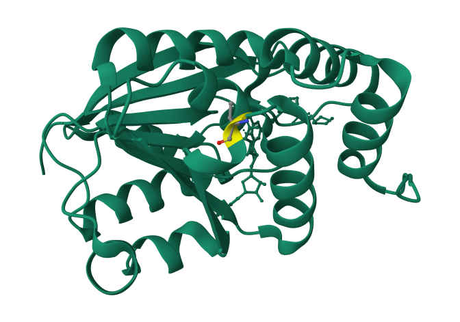
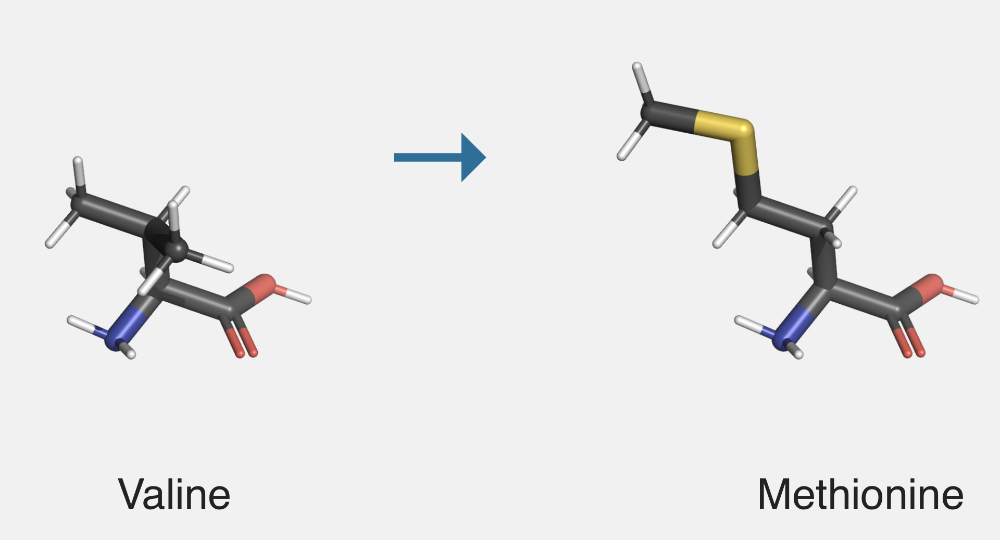
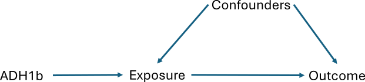
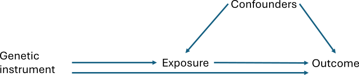
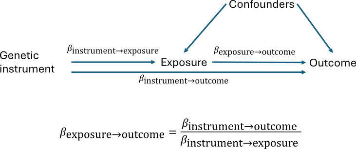

---
title: Genetics of common complex psychiatric disorders II
author: Mark James Adams
format: 
  revealjs:
    embed-resources: true
    self-contained-math: true
  pdf: default
execute:
  warning: false
  message: false
  echo: false
--- 

# Part 2: Molecular genetics

Mark James Adams  
Division of Psychiatry  
`mark.adams@ed.ac.uk`  
*Genetics and Environmental Influences on Behaviour and Mental Health*

```{r plotting}
#| echo: false

# font size for plotting
base_size <- function(html = 16, latex = 10) {
  size = 12
  if (knitr::is_html_output()) {
    size = html
  } else if (knitr::is_latex_output()) {
    size = latex
  }
  size
}
```

## Structure of DNA



:::{.notes}
Deoxyribonucleic acid (DNA) is a large macromolecule composed of antiparallel (going in opposite directions) chains of nucleotides. Each nucleotide consists of a pair of nucleobases (Adenine paired with Thymine, Cytosine paired with Guanine).

[DNA](https://www.genome.gov/genetics-glossary/Base-Pair) image public domain National Institutes of Health.
:::

## Gene structure



:::{.notes}
A portion of the genome contains genes that encode proteins. A gene has a promotor region, which is a DNA sequence that where and how much the gene is expressed. A gene contains a number of exons (coding sequence, determining the amino acide composition of the protein) and introns (non-coding sequence). DNA is transcribed into RNA, which is then spliced into mRNA and then becomes the template for the animo acid chain which folds into a protein.
- Promoter: sequence determines where and how much of a gene is turned into RNA 
- Exon: coding sequence, determines the amino acid composition of the protein 
- Intron: non-coding sequence 

Gene structure image from Figure 1.7, *[An Owner's Guide to the Human Genome](https://web.stanford.edu/group/pritchardlab/HGbook.html)* CC-BY Jonathan Pritchard.
:::

## Types and sizes of genetic variants

```{r}
#| label: variant_types
require(dplyr)
require(ggplot2)

variant_types <- tribble(
  ~type, ~magnitude_start, ~magnitude_end, ~x,
  "SNP", 0.5, 2, 1,
  "Indel", 2, 50, 2,
  "STR", 5, 500, 3,
  "Retroelements", 100, 1000, 4,
  "Structural", 1000, 3.5e6, 5,
  "Chromosomal", 3.5e6, 2.5e8, 6
)

# find middle between 2 points on log10 scale
middle_log10 <- function(start, end) {
  10^( (log10(start) + log10(end)) / 2)
}

ggplot(
  variant_types,
  aes(
    x = x,
    xend = x,
    y = magnitude_start,
    yend = magnitude_end
)) +
  geom_segment(
    arrow = arrow(length = unit(3, "points"),
    type = "closed", ends = "both")
  ) +
  geom_label(
    aes(
      label = type,
      x = x + 0.5,
      y = middle_log10(magnitude_start, magnitude_end),
    label.size = base_size(),
    size.unit = "pt"
    )
  ) +
  scale_x_continuous("", breaks = NULL) +
  scale_y_continuous(
    "Size in basepairs",
    transform = "log10",
    breaks = c(1e0, 1e1, 1e3, 1e6, 1e8),
    labels = c("1 bp", "10 bp", "1 kbp", "1 Mbp", "100 Mbp")
  ) +
  coord_flip() +
  theme_minimal(base_size = base_size())
```

:::{.notes}
The smallest genetic variants are single base-pair substitutions: Single Nucleotide Polymophism (SNP). Insertion/Deletions (indel) are slightly larger substitutions or 2 or up to a dozen nucleotides. Short Tandem Repeats (STR) are varying number of repeats of three-nucleotide codes. STRs can cause conditions like Huntington's Disease, where a normal copy of the gene will have 10–26 repeats while the Huntington's version will have 37–80 repeats. Microinsertions or microdeletions are structural variants about 1 megabase (Mb) in size, like the 15q13.3 microdeletion that increases risk of intellectual disability, seizures, and psychiatric illness. At the largest scale are inversions and translocations of parts of the chromosome or having more than two copies of a chromosome.
:::

## Chromosomes

Diploid (two copies of each chromosome)



:::{.notes}
[Chromosome](https://bioart.niaid.nih.gov/bioart/551) image public domain National Institutes of Health.
:::

## Single Nucleotide Polymorphisms (SNP) {.smaller}



- Single base of DNA is substituted with another.
- Occur in 1 of every 100 - 1000 basepairs (bp).
- Currently, ± 1.2B SNPs are known.
- Labelled with a dbSNP Reference ID ("rs number")

:::{.notes}
"SNP" is pronounced "snip". [dbSNP](https://www.ncbi.nlm.nih.gov/snp/) is a database for finding information on SNPs in the human genome. 

[DNA-SNP images](https://commons.wikimedia.org/wiki/File:Dna-SNP.svg) CC-BY David Eccles.
:::

## Candidate gene studies (circa 2000)

::: {.content-visible unless-format="html"}
Advances in genotyping technology led to a new approach to study genetic effects. Instead of tracking inheritance through families, it was possible to look at the frequency of a variant in unrelated affected (cases) or unaffected (controls) people. Genotyping was still expensive so studies examined only a small handful of “candidate” genes chosen because of biological significance (usually related to neurotransmission).
:::

Example: Catechol-O-methyltransferase (COMT)

::::{.columns}

:::{.column}



:::

:::{.column}



:::

::::

SNP rs4680 G>A substitution (missense variant) results in amino acid change from valine to methionine at codon 158 (Val158Met).

:::{.notes}
COMT is involved in inactivation of dopamine, epinephrine, and norepinephrine. The Val variant metabolises dopamine at a higher rate than the Met variant. It was proposed that the [rs4680](https://www.ncbi.nlm.nih.gov/snp/rs4680) SNP was related to a large number of psychiatric disorders, but these results have not replicated. 

Another highly studies variant was 5-HTTLP (serotonin-transporter-linked polymorphic region) in SLC6A4 (serotonin transporter gene).

> “linkage studies investigate correlations between a disease and inheritance of specific chromosomal regions in families, whereas association studies focus on differences in the frequency of specific genetic markers in groups of affected and unaffected individuals.”

- Sullivan … Neale (2001) Genetic Case-Control Association Studies in Neuropsychiatry, ARCH GEN PSYCHIATRY 58
- Border et al. [No Support for Historical Candidate Gene or Candidate Gene-by-Interaction Hypotheses for Major Depression Across Multiple Large Samples](https://dx.doi.org/10.1176/appi.ajp.2018.18070881). American Journal of Psychiatry doi:10.1176/appi.ajp.2018.18070881
:::

# GWAS

## Genome-wide associations studies (GWAS) (2007 - today)

- Candidate gene findings did not replicate
- Power analysis: candidate gene study sample sizes were _vastly_ too small
- Alternative: Assay the whole genome (hundreds of thousands or millions of variants) 
- Hypothesis-free testing

:::{.notes}
A genome-wide association study (GWAS) is a hypothesis-free method of finding genetic factors that are associated with a trait or disease. Any two individuals randomly sampled from the population will differ in only about 0.5% of their genetic makeup.

Sullivan. [Spurious Genetic Associations Biological Psychiatry](https://dx.doi.org/10.1016/j.biopsych.2006.11.010) 10.1016/j.biopsych.2006.11.010

[Psychiatric Genomics Consortium](https://pgc.unc.edu) is one of the largest biological experiments in the world.
:::

## Conducting a GWAS

- Two alleles: A and a 
- Three genotypes: AA, Aa, aa
- Arbitrarily select one allele (A) as the _effect_ allele
- For each subject, count number of effect alleles: $x = 0, 1, 2$

:::{.notes}
An association test is performed by comparing a genotype at a particular SNP marker to a phenotype (a trait or disease). This test is usually done within a regression framework, using linear regression for continuous/quantitative phenotypes (like height) or a logistic regression for a binary or case/control phenotype (like disease status). 

At each SNP there are typically two alleles, for example C and T. This allows for four possible genotypes: CC homozygote, CT or TC heterozyogotes, and TT homozygotes. The basic association tests assumes that substituting one allele for the other has an additive effect on the phenotype. This means that the model assumes that the average difference in phenotype between the CC genotype and the CT genotype is the same as between the CT and TT genotype.
:::


## 

```{r}
#| label: gwas_sim
require(ggplot2)

set.seed(3128279)
beta <- 1
freq <- 0.3
n <- 100
genotypes <- sample(0:2, size = n, replace = TRUE, prob = c((1-freq^2), 2*freq*(1-freq), freq^2))
phenotypes <- 2.7 + beta * genotypes + rnorm(n)

ggplot(
  data.frame(phenotype = phenotypes, genotype = genotypes),
  aes(x = genotype, y = phenotype)
) +
  stat_smooth(method = lm, se = FALSE) +
  scale_x_continuous("SNP genotype", breaks = c(0, 1, 2)) +
  scale_y_continuous("Phenotypic score") +
  geom_point() +
  theme_classic(base_size = base_size(html = 24))
```


:::{.notes}
- Regress on phenotype $Y$
- Linear regression: $Y \sim \alpha + \beta x + \mathrm{covariates}$
- Logistic regression: $\mathrm{Prob}(Y= 1) \sim \mathrm{logit}^{-1}(\alpha + \beta x + \mathrm{covariates})$
- Repeat for all markers

To run the regression, the SNP genotype is encoded to a number as a count of one of the alleles (which allele is chosen is arbitrary, but traditionally it is allele with the lower frequency, called the minor allele). The chosen allele is called the "effect allele". In this example, if the T allele is chosen as the effect allele, then the numeric encoding is the number of T alleles in the genotype: CC = 0, CT and TC = 1, and TT = 2. This numeric representation can then be entered into a regression formula.

From the fitted regression model, the beta coefficient $\beta$ for the SNP represents the average substitution effect of having one additional copy of the effect allele. 

Binary traits like disease status are analysed as case-control studies using logistic regression. In a case-control analysis, the beta coefficient represents the change in log-odds of having the disease for every additional copy of the effect allele. Exponentiating the beta coefficient,  $\exp(\beta)$, converts the effect size to an odds ratio.

- Balding, D. [A tutorial on statistical methods for population association studies](https://doi.org/10.1038/nrg1916). Nat Rev Genet 7, 781–791 (2006). doi:10.1038/nrg1916
- Uffelmann, E., et al. [Genome-wide association studies](https://doi.org/10.1038/s43586-021-00056-9). Nat Rev Methods Primers 1, 59 (2021). doi:10.1038/s43586-021-00056-9
:::

## 15+ years of GWAS

```{r}
#| label: gwas_catalog
#| cache: true
require(readr)
require(dplyr)
require(tidyr)
require(stringr)
require(lubridate)
require(ggplot2)
studies <- read_tsv("https://www.ebi.ac.uk/gwas/api/search/downloads/studies")

studies_sizes <- studies |>
  transmute(
    PUBMEDID,
    `DISEASE/TRAIT`,
    DATE,
    `ASSOCIATION COUNT`,
    sample_size = str_extract_all(
      str_remove_all(
        `INITIAL SAMPLE SIZE`,
        pattern = ","
      ),
      pattern = "[0-9]+"
    )
  ) |>
  unnest_longer(sample_size) |>
  group_by(PUBMEDID, `DISEASE/TRAIT`, DATE, `ASSOCIATION COUNT`) |>
  summarise(sample_size = sum(as.numeric(sample_size)))

# top 13 most studied traits
traits13 <- studies |> 
  count(`DISEASE/TRAIT`) |> 
  arrange(desc(n)) |> 
  slice_head(n = 13) |>
  pull(`DISEASE/TRAIT`)

studies_avg <-
studies_sizes |>
  filter(`DISEASE/TRAIT` %in% traits13) |>
  mutate(year = year(DATE)) |>
  group_by(`DISEASE/TRAIT`, year) |>
  summarize(
    associations = max(`ASSOCIATION COUNT`), sample_size = max(sample_size)
  ) |>
  filter(associations >= 1)

ggplot(
  studies_avg,
  aes(
    x = year,
    y = associations,
    colour = `DISEASE/TRAIT`,
    size = sample_size
  )
) +
  geom_point() +
  scale_y_log10("Number of associations") +
  scale_x_continuous("Year")
```

:::{.notes}
Abdellaoui, A., Yengo, L., Verweij, K. J. H. & Visscher, P. M. 15 years of GWAS discovery: Realizing the promise. Am J Hum Genetics (2023) doi:[10.1016/j.ajhg.2022.12.011](https://doi.org/10.1016/j.ajhg.2022.12.011).
:::
  
## GWAS data {.smaller}

```{r}
#| label: gwas
require(topr)

knitr::kable(head(CD_UKBB))
```

:::{.notes}
The output of a GWAS contains information about the variant:

- CHROM: chromosome
- POS: basepair position
- ID: variant identifier (usually rsID)
- REF: reference allele
- ALT: alternative allele
- AF: allele frequency

and information from the association:

- OR: effect size (in this case, odds ratio)
- P: p-value of the association, from a Chi-Squared test
:::

## Plotting GWAS results

```{r}
#| label: gwasp
require(topr)
gwas_null <- rbind(CD_UKBB, CD_UKBB, CD_UKBB, CD_UKBB, CD_UKBB) |>
  mutate(P = runif(length(P), 0, 1))
g <- manhattan(gwas_null, log_trans_p = FALSE, sign_thresh = NULL, downsample_cutoff = 0, ymin = 0, ymax = 1) + scale_y_continuous("P")
g
```

:::{.notes}
Plotting the P-value for each position along each chromosome is not very informative
:::

## Plotting GWAS results

```{r}
#| label: manhattan
require(topr)
manhattan(CD_UKBB)
```

:::{.notes}
Instead, a $-\log_{10}$ ("negative log 10") transformation is applied to each p-value. This transformation makes larger (non-significant) p-values very small while smaller (more signficant) p-values become very large. Typically, a genome-wide significant threshold of $p < 5 \time 10^{-8}$ is applied, which corrects for multiple testing based on the number of independent regions in the genome.

A $p$ value of 1 maps $-\log_{10}(0) \rightarrow 0$ while a value like $p = 5 \time 10^{-8}$ maps $-\log_{10}(5 \time 10^{-8}) \rightarrow -7.301$.

Each dot in a plot is a different variant. The peaks occur around significant variants that are closely linked to each other on the genome.
:::

## Region plots

```{r}
#| label: regionplot
regionplot(CD_UKBB, gene="IL23R")
```

:::{.notes}
Zooming in on a particular region of the genome, it is possible to see which genes are potentially implicated by the association.
:::

## Linkage disequilibrium

```{r}
#| label: locuszoom
locuszoom(R2_CD_UKBB)
```

:::{.notes}
Within a region of the genome, nearby genotypes are correlated with each other, which is referred to as linkage-disequilibrium (LD). In this example the $R^2$ linkage disequilibrium of each variant with the target SNP (rs11576518) is plotted in different colors. 
:::

## Key findings from psychiatric GWAS {.smaller}
| Disorder                                 | Key findings                                                                |
| :--------------------------------------- | :-------------------------------------------------------------------------- |
| Alcohol dependence                       | Genetically distinct from alcohol consumption but alcohol metabolism is key |
| Attention deficit/hyperactivity disorder | Common variants do not explain sex bias                                     |
| Bipolar disorder                         | Calcium channel genes; neuronal hyperexcitability; Bipolar I ⇌ Schizophrenia; Bipolar II ⇌ Major depressive disorder|
| Major depression                         | Synaptic structure, neurotransmission; Prefrontal brain regions; Both ancestry and geography matter               |
| Post-traumatic stress disorder           | Higher heritability in women                                                |
| Schizophrenia                            | Glutamatergic neurotransmission; Immunity; Disruptive coding variants                                                  |

:::{.notes}
- AD: [Walters … Agrawal. (2018). *Nature Neuroscience*](https://dx.doi.org/10.1038/s41593-018-0275-1)
- ADHD: [Martin … Neale (2018). *Biological Psychiatry*](https://dx.doi.org/10.1016/j.biopsych.2017.11.026)
- BIP: [Stahl … Sklar (2019). *Nature Genetics*](https://dx.doi.org/10.1038/s41588-019-0397-8); [Mullins … Andreassen (2021) *Nat Genet*](https://dx.doi.org/10.1038/s41588-021-00857-4)
- MDD: [Howard … McIntosh (2019). *Nature Neuroscience*](ttps://doi.org/10.1038/s41593-018-0326-7); [Giannakopoulou … Kuchenbäcker (2021) *JAMA Psychiatry*](https://dx.doi.org/10.1001/jamapsychiatry.2021.2099); [Adams … McIntosh (2025) *Cell*](https://doi.org/10.1016/j.cell.2024.12.002).
- PTDS: [Duncan…Koenen (2017) *Molecular Psychiatry*](https://doi.org/10.1038/mp.2017.77)
- SCZ: [Ripke…O’Donovan (2014). *Nature*](10.1038/nature13595); [Trubetskoy … PGC SCZ (2002) *Nature*](https://dx.doi/org/10.1038/nature13595)

For review see Sullivan, P. F. & Geschwind, D. H. Defining the Genetic, Genomic, Cellular, and Diagnostic Architectures of Psychiatric Disorders. Cell 177, 162–183 (2019). doi:[10.1016/j.cell.2019.01.015](https://dx.doi.org/10.1016/j.cell.2019.01.015).
  
:::

## Crossing diagnostic boundaries

Genetic correlation between phenotypes based on GWAS data

```{r}
#| label: atlas
require(readr)
require(corrplot)
ldsc <- read_csv(here::here("data/bulik-sullivan/41588_2015_BFng3406_MOESM39_ESM.csv"))

traits <- with(ldsc, unique(c(Trait1, Trait2)))
ldsc_mat <- diag(length(traits))
dimnames(ldsc_mat) <- list(traits, traits)
for(i in seq.int(nrow(ldsc))) {
  trait1 <- ldsc[i,'Trait1'][[1]]
  trait2 <- ldsc[i, 'Trait2'][[1]]
  rg <- ldsc[i,'rg'][[1]]
  ldsc_mat[trait1,trait2] <- ldsc_mat[trait2, trait1] <- rg
}
ldsc_mat[ldsc_mat > 1] <- 1
psych_traits <- c("ADHD", "Anorexia", "Bipolar", "Depression", "Schizophrenia")
corrplot(ldsc_mat[psych_traits,psych_traits])
```

:::{.notes}
Studying genetics relationships using GWAS data makes it possible to compare psychiatric disorders even if they were collected in different samples.

- Bulik-Sullivan…Daly. (2015). [An atlas of genetic correlations across human diseases and traits](https://dx.doi.org/10.1038/ng.3406). *Nature Genetics*, 47 (11), 1236. doi:10.1038/ng.3406
- Smoller…Kendler (2019). [Psychiatric genetics and the structure of psychopathology](https://dx.doi.org/10.1038/s41380-017-0010-4). *Molecular Psychiatry*, 24 (3), 409. doi:10.1038/s41380-017-0010-4
:::

# Prediction

## GWAS is a model

$$
Y \sim a + b_i \times \mathrm{SNP}_i + e
$$

:::{.notes}
A genome-wide association study can be described as a series of regression analyses: **Estimate** coefficient $b_i$ from regressing phenotype $Y$ on SNP genotype $\mathrm{SNP}_i$, with $e$ as the error term.
:::

## What if we reverse that?

$$
\hat{Y} = \hat{a} + \hat{b} \times \mathrm{SNP}
$$

:::{.notes}
**Predict** phenotype $\hat{Y}$ from regression coefficient estimate $\hat{b}$ and SNP genotype.
:::

## Polygenic score

$$
\hat{Y} = \sum_i^n \hat{b}_i \times \mathrm{SNP}_i
$$

:::{.notes}
Also called a "polygenic index", "genetic score", or "polygenic risk score" (PRS) it uses $n$ selected SNPs from a GWAS. 
:::

## Calculating polygenic scores {.smaller}

|SNP        |Effect allele|Non-effect allele|Beta   |$P$  |
|-----------|-------------|-----------------|-------|---  |
|rs61902807 | C           |T                |-0.0352| $1.45 \times 10^{-44}$|
|rs12142986 | T           |C                |0.0318| $3.38 \times 10^{-41}$|
|rs4702     | G          |A                |0.0276| $1.15 \times 10^{-30}$|

At SNP rs61902807, the genotype contributions to the score would be

- TT: 0
- CT or TC: -0.0352
- CC: `r 2*-0.0352`

## Polygenic prediction of major depression {.smaller}

```{r}
#| label: mddprs
require(dplyr)
require(readr)
require(ggplot2)

musliner <- read_table(here::here("data/musliner-depression-pgs/musliner-etable-3.txt")) |>
  mutate(PRS = case_match(
    PRS,
    'BD' ~ "Bipolar disorder PRS",
    "MD" ~ "Depression PRS",
    "SZ" ~ "Schizophrenia PRS"))

ggplot(musliner, aes(x = Decile, y = HR, ymin = LCL, ymax = UCL)) +
  geom_point() +
  geom_errorbar() +
  scale_x_continuous("PRS Decile", breaks=1:10) +
  scale_y_continuous("Hazard ratio for depression") +
  facet_grid(cols = vars(PRS)) +
  theme_minimal(base_size = base_size())
```

:::{.notes}
> "Polygenic liability for [major depression] is associated with first depression in the general population, which supports the idea that these scores tap into an underlying liability for developing the disorder. The fact that polygenic risk for [bipolar disorder] and polygenic risk for [schizophrenia] also were associated with depression is consistent with prior evidence that these disorders share some common genetic overlap. Variations in polygenic liability may contribute slightly to heterogeneity in clinical presentation, but these associations appear minimal."

- Musliner, K. L. et al. [Association of Polygenic Liabilities for Major Depression, Bipolar Disorder, and Schizophrenia With Risk for Depression in the Danish Population](https://dx.doi.org/10.1001/jamapsychiatry.2018.4166). Jama Psychiat 76, (2019). doi:10.1001/jamapsychiatry.2018.4166
:::

## Research and clinical utility

> "The accuracy with which a polygenic score can predict psychiatric illnesses, such as schizophrenia, bipolar disorder and major depression, is currently not sufficient for clinical use."

International Society of Psychiatric Genetics, *[Advisory on the Use of Polygenic Risk Scores to Screen Embryos for Adult Mental Conditions.](https://ispg.net/ethics-statement/)*

:::{.notes}
Polygenic indices are a standard tool in genetic research. They can be used to understand the polygenic architecture of different phenotypes or disorders. For example, researchers might use polygenic risk scores for major depressive disorder to predict bipolar disorder in an independent sample, to show that there is a common genetic basis to multiple psychiatric disorders. Polygenic indices might also be used in study design. A recall-by-genotype (RbG) design selects or prioritises recruitment of patients based on their genotype or their polygenic score, and then conducts a stratified analysis analogous to a randomised control trial (RCT).

For the most part, polygenic indices currently have low clinical utility. This is because they only explain a small fraction of the phenotypic variance ($R^2$ < 10%).

In general, polygenic indices have the following actual and potential applications:

- Test for overall strength of GWAS association and quantify variance explained
- Risk stratification (i.e. identifying people to later test for specific disease)
- Aid in clinical diagnosis
- Test for genetic overlap between traits (e.g. does a Depression score predict cardiovascular disease?)
- Trait imputation when not measured (obviously imperfect and dependent on heritability)
- Personalised treatment (GWAS on treatment response are gaining power)
- Any hypothesis where you rely on a risk or liability (e.g. GxE interactions)

- Corbin, L.J., Tan, V.Y., Hughes, D.A. et al. [Formalising recall by genotype as an efficient approach to detailed phenotyping and causal inference](https://doi.org/10.1038/s41467-018-03109-y). Nat Commun 9, 711 (2018). doi:10.1038/s41467-018-03109-y
- Lewis, C.M., Vassos, E. [Polygenic risk scores: from research tools to clinical instruments](https://doi.org/10.1186/s13073-020-00742-5). Genome Med 12, 44 (2020). doi:10.1186/s13073-020-00742-5
:::

# Causal analysis

## Causality from genetics: Mendelian Randomisation

Mendel’s Second Law of Independent Assortment is analogous to a randomised control trial, dubbed "Mendelian randomisation (MR). 

- Uses: Overcome confounding, reverse causation, selection bias, measurement attenuation
- Limitations: Reliable gene–phenotype link, pleiotropy, linkage disequilibrium

:::{.notes}
Davey Smith G, Ebrahim S. [What can mendelian randomisation tell us about modifiable behavioural and environmental exposures](https://dx.doi.org/10.1136/bmj.330.7499.1076)? BMJ. 2005 7;330(7499):1076-9. doi:10.1136/bmj.330.7499.1076. 
:::

## Genetic variant as an instrumental variable



:::{.notes}
A genetic variant that influences exposure can become an *instrument* for the effect of an exposure on an outcome

Paradigmatic example: Alcohol dehydrogenase (ADH) enzymes that metabolises alcohol
- ADH1B\*2 variant degrades alcohol more quickly
- ADH1B\*2 carriers find drinking alcohol less tolerable
:::

## Genetic instrument from GWAS on exposure and outcome {.smaller}



:::{.notes}
Mendelian randomisation can be done using data from GWAS on the exposure variable and on the outcome variable. The causal path from the exposure to the outcome can then potentially be estimated.
:::

## Estimating effect of exposure on outcome {.smaller}




:::{.notes}
An estimate of the effect of the exposure on the outcome ($\beta_{\mathrm{exposure}\rightarrow\mathrm{outcome}}$) can be found by assuming that the effect of the genetic instrument on the outcome ($\beta_{\mathrm{instrument}\rightarrow\mathrm{outcome}}$) is the product of the effect of the instrument on the exposure and the exposure on the outcome: $\beta_{\mathrm{instrument}\rightarrow\mathrm{exposure}} \times \beta_{\mathrm{exposure}\rightarrow\mathrm{outcome}} = \beta_{\mathrm{instrument}\rightarrow\mathrm{outcome}}$. The effects of the genetic instrument, $\beta_{\mathrm{instrument}\rightarrow\mathrm{exposure}}$ and $\beta_{\mathrm{instrument}\rightarrow\mathrm{outcome}}$, are estimated from GWAS data and then the effect of the exposure on the outcome is calculated as $\beta_{\mathrm{exposure}\rightarrow\mathrm{outcome}} = \frac{\beta_{\mathrm{instrument}\rightarrow\mathrm{outcome}}}{\beta_{\mathrm{instrument}\rightarrow\mathrm{exposure}}}$

- Davey Smith, G, and Hemani, G. 2014. [Mendelian randomization: genetic anchors for causal inference in epidemiological studies](https://doi.org/10.1093/hmg/ddu328). *Human Molecular Genetics* 23 (R1): R89—–R98. doi:10.1093/hmg/ddu328.
- Pierce, B L, and Burgess, S. 2013. [Efficient design for Mendelian randomization studies: subsample and 2-sample instrumental variable estimators](https://doi.org/10.1093/aje/kwt084). *American Journal of Epidemiology* 178 (7): 1177–84. doi:10.1093/aje/kwt084.
- Skrivankova, V. W. et al. Strengthening the Reporting of Observational Studies in Epidemiology Using Mendelian Randomization. Jama 326, 1614–1621 (2021). doi:10.1001/jama.2021.18236.
  
:::

##

### Mendelian randomisation study: modifiable risk factors and depression


:::{.notes}
Choi, K. W. et al. An Exposure-Wide and Mendelian Randomization Approach to Identifying Modifiable Factors for the Prevention of Depression. Am J Psychiat appi.ajp.2020.1 (2020) doi:10.1176/appi.ajp.2020.19111158.
:::

##

```{r}
#| label: choi-mr
require(readr)
require(dplyr)
require(ggplot2)

choi_mr <- read_csv(here::here("data/choi-mr/choimr_tables3_mr_results_facs_dep.csv"))

choi_mr_inv <- choi_mr |>
  filter(method == "Inverse variance weighted") |>
  filter(pval <= 0.01)

ggplot(choi_mr_inv, aes(x = desc, y = expb, ymin = cilo, ymax = ciup)) +
  geom_hline(yintercept = 1, colour = "gray") +
  geom_pointrange() +
  scale_y_continuous("Odds ratio") +
  scale_x_discrete("Modifiable factor") +
  coord_flip() +
  theme_minimal(base_size=base_size())
```

:::{.notes}
> "Numerous factors across social, sleep, media, dietary, and exercise-related domains were prospectively associated with depression, even among at-risk individuals. However, only a subset of factors was supported by Mendelian randomization evidence, including confiding in others, television watching time, and daytime napping."
:::

# Resources

::: {.content-visible unless-format="html"}
**Research Resources**

- Converting polygenic scores to absolute scale [https://opain.github.io/GenoPred/PRS_to_Abs_tool.html](https://opain.github.io/GenoPred/PRS_to_Abs_tool.html)
- Polygenic Score Catalog. [https://www.pgscatalog.org/](https://www.pgscatalog.org/)
- Polygenic Scores Explained. [http://polygenicscores.org/explained/](http://polygenicscores.org/explained/)

**Audio Resources**

- Thinking Mind Podcast: "Interview #52: How does Genetics Affect our Mental Health? (Professor Cathryn Lewis)" [https://www.youtube.com/watch?v=H9jr1v0c7NQ](https://www.youtube.com/watch?v=H9jr1v0c7NQ)
- The Genetics Podcast: "EP 4 The Genetics of Depression with Prof. Cathryn Lewis" [https://thegeneticspodcast.fireside.fm/4](https://thegeneticspodcast.fireside.fm/4)
- talkBD: "Episode 33 The Genetics of Bipolar Disorder with Dr. Jehannine Austin" [https://talkbd.live/genetics-of-bipolar-disorder/](https://talkbd.live/genetics-of-bipolar-disorder/)
- The Genetics Podcast: "EP 13 How Eurocentricity is holding genetics back with Dr. Alicia Martin" [https://thegeneticspodcast.fireside.fm/13](https://thegeneticspodcast.fireside.fm/13)


Resources for looking up GWAS results:

- GWAS Catalog: Comprehensive catalog of phenotype-SNP associations. Usually only contains independent significant SNPs from each study. [https://www.ebi.ac.uk/gwas/](https://www.ebi.ac.uk/gwas/)
- OpenGWAS Catalogue: Database of full summary statistics for a large number of traits, available for querying and downloading in a standardised format. [https://gwas.mrcieu.ac.uk/](https://gwas.mrcieu.ac.uk/)
- Psychiatric Genomics Consortium (PGC): Full summary statistics on psychiatric disorders. [https://pgc.unc.edu](https://pgc.unc.edu)
- Social Sciences Genetic Association Consortium (SSGAC): Full summary statistics on social and behavioural traits like education and personality. [https://www.thessgac.org/](https://www.thessgac.org/)
- Pheweb: Full summary statistics from Biobank Japan [https://pheweb.jp](https://pheweb.jp)
- FinnGenn: Full summary statistics from Finnish biobanks [https://www.finngen.fi/en/access_results](https://www.finngen.fi/en/access_results)
:::